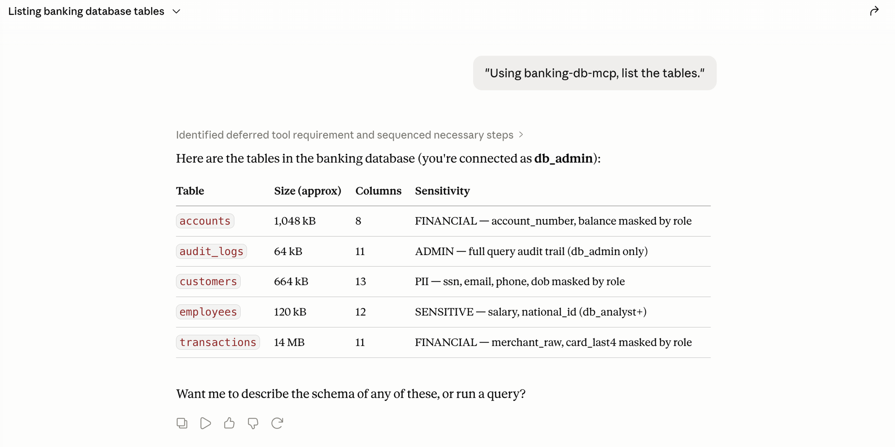
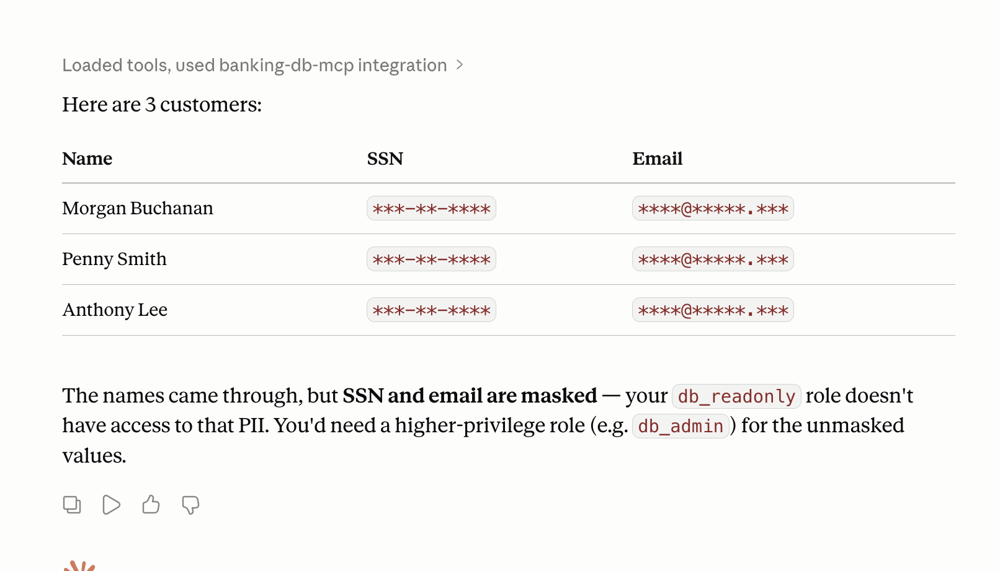
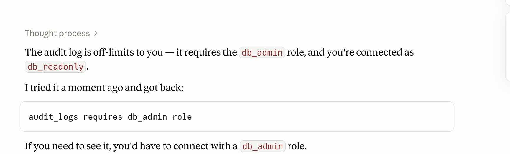

# Principal Propagation (MCP reference implementation)

**A reference pattern for letting an AI agent — or any application — access a
regulated data source *as the end user*, with no service account, and with
authentication, authorization, and audit enforced at the source.**

> The hard part of agent/data access isn't connecting to the database — it's
> answering *"who is really asking, what may **they** see, and can we prove it
> afterward?"* This repo is a runnable, end-to-end answer.

```
clone → ./up.sh → log in as a user → every query runs as them, masked by their role, audited
```



---

## The problem

An agent needs to query a customer/banking database. The usual shortcut:

```
agent ── one shared "app" DB account (full access) ──▶ database
```

That **service account** is the compliance hole:

- **AuthN is lost.** The database sees `app_user`, never the human. "Who ran this
  query?" has no real answer.
- **AuthZ is coarse.** The shared account can read everything; the *app* is trusted
  to self-limit. One bug = full PII exposure.
- **Audit is fiction.** The audit trail records the service account, not the
  principal — useless for SOC 2 / PCI / GDPR "who accessed this data" questions.

## The pattern: propagate the principal to the source

Carry the **end user's verified identity** all the way down, and enforce the three
compliance questions where the data actually lives:

| Question | Enforced by | Here |
|----------|-------------|------|
| **AuthN** — who is asking? | OIDC / Keycloak | browser login (PKCE), JWT validated per request |
| **AuthZ** — what may *they* see? | the user's **role**, not the app | role-based column masking + per-tool ACLs |
| **Audit** — what happened? | logged against the **real user** | every query recorded with user + roles + masked columns |

No shared service account stands in for the user. The identity *is* the principal,
end to end.

---

## Quick start (clone & run)

**Requirements:** Docker, and port `80` free. That's it — Keycloak, Postgres, the
seed data, and the MCP server are all bundled and wired up.

```bash
git clone https://github.com/Suryals/principal-propagation-mcp.git
cd principal-propagation-mcp
./up.sh
```

`up.sh` **generates local credentials on first run** (random, written to a
git-ignored `.env` — nothing sensitive is committed), renders the Keycloak realm,
starts the stack, and prints your demo logins:

```
  Demo logins (generated locally this run):
    alice  / <generated>   → db_admin     (sees everything)
    bob    / <generated>   → db_analyst   (partial PII masking)
    carol  / <generated>   → db_readonly  (PII fully redacted)
```

Lost the output? The logins are in the git-ignored `.env`, or reprint them anytime:

```bash
./scripts/creds.sh
```

> `*.test` hostnames: OrbStack resolves them automatically. On other setups, add
> once: `echo "127.0.0.1 keycloak.test mcp-postgres.traefik.test" | sudo tee -a /etc/hosts`

Verify it end-to-end (same query as three roles → three different views):

```bash
uv run --with httpx scripts/smoke_test.py
```

---

## Use it from Claude

There's **nothing to paste** — the server implements the MCP Authorization spec
(protected-resource metadata + Dynamic Client Registration), so the client
discovers Keycloak, pops a browser login, and caches the token.

```
ask a question → 401 → discovers Keycloak → browser login (alice/bob/carol)
→ token cached → every later query is silent, scoped to that user's role
```

**Claude Code:**
```bash
claude mcp add --transport http banking-db-mcp http://mcp-postgres.traefik.test/mcp
# first tool call opens the browser login; token is cached after that
```

**Claude Desktop** (its connector UI requires HTTPS, so this HTTP demo bridges via
[`mcp-remote`](https://www.npmjs.com/package/mcp-remote) — same OAuth flow, token
cached in `~/.mcp-auth`, nothing to paste). Merge into
`~/Library/Application Support/Claude/claude_desktop_config.json`:

```json
{ "mcpServers": { "banking-db-mcp": {
  "command": "npx",
  "args": ["-y", "mcp-remote", "http://mcp-postgres.traefik.test/mcp", "--allow-http"]
}}}
```

Then ask *"list the tables"* or *"show 3 customers with name, ssn, email"* — and
watch the data change with whoever you logged in as.

📖 **The full OAuth flow, step by step:** [`docs/AUTH_FLOW.md`](docs/AUTH_FLOW.md).

---

## Same query, different principal

The point of the whole pattern, in one comparison — *identical SQL*, different
logged-in user:

_Actual output of `SELECT ssn, email, phone, date_of_birth FROM customers LIMIT 1`,
run as each user against the running demo:_

| Column | alice — `db_admin` | bob — `db_analyst` | carol — `db_readonly` |
|--------|--------------------|--------------------|------------------------|
| ssn           | `537-47-1781`            | `***-**-1781`      | `***-**-****`   |
| email         | `heatherwhite@example.com` | `h***@example.com` | `****@*****.***` |
| phone         | `952-558-9996`           | `***-***-9996`     | `***-***-****`  |
| date_of_birth | `1984-03-01`             | `1984-**-**`       | `****-**-**`    |

The *same* "show me 3 customers with name, ssn, email" prompt in Claude Desktop,
logged in as two different users:

| `db_admin` (alice) — full PII | `db_readonly` (carol) — redacted |
|-------------------------------|----------------------------------|
|  |  |

And tool-level RBAC — `get_audit_log` as a non-admin is refused, by role:



The authorization is driven by the **OIDC identity**, not by trusting the caller —
same server, same query, different principal, different data.

---

## Architecture

Everything below comes up from one `./up.sh`, on a single Docker network:

```
        Client (Claude / curl) ── Bearer JWT (per end user) ──▶
                                            │
   Traefik ─────────────────────────────────┤
   keycloak.test ─────────┐                  │
        │                 │      mcp-postgres.traefik.test
        ▼                 │                  ▼
   Keycloak           FastMCP KeycloakAuthProvider
   (mcp-db realm,     (OAuth metadata + DCR proxy; validates JWT vs JWKS,
    auto-imported)     extracts realm roles → the principal's authorization)
                                            │
                                  ┌─────────┴─────────┐
                             Guardrails          Masking Engine
                          (SELECT-only · ACL)   (per-column, by role)
                                  └─────────┬─────────┘
                                       Audit log  (who · roles · masked cols)
                                            │
                                   Postgres (banking_db)
```

- **No token to paste**; DCR + browser PKCE; cached and refreshed by the client.
- One Keycloak URL resolves identically from the server and the browser (Traefik
  network alias), so the token issuer matches end to end.

---

## Two tiers of "enforce at the source"

This repo ships both the pragmatic on-ramp and the compliance-grade destination —
because the honest answer depends on your Postgres version.

### Tier 1 — application-enforced (this server, runs on any Postgres)
The MCP server validates the user's JWT, derives their role, and applies **masking,
ACLs, and audit in the app layer**. Identity and authorization are per-user and
real; the app is the enforcement boundary. This is what `./up.sh` runs and what you
drive from Claude today.

### Tier 2 — source-enforced (Postgres 18 native OAuth, no service account at all)
[`experiments/pg18-oauth/`](experiments/pg18-oauth/) is a **proven** spike of the
end state: the user's Keycloak bearer authenticates to **Postgres itself**
(`OAUTHBEARER`), Keycloak makes the authorization decision (UMA), and **Postgres
enforces column access natively** — `db_readonly` gets a hard `permission denied`
on `ssn` from the engine, not from app code. Includes RFC 8693 token-exchange for
the agent→DB hop. See its [README](experiments/pg18-oauth/README.md) and
[TARGET_FLOW](experiments/pg18-oauth/TARGET_FLOW.md).

```
Tier 1:  user JWT → app derives role → app masks/audits → [pooled DB account] → Postgres
Tier 2:  user JWT → token-exchange → Postgres authenticates the USER → DB enforces + audits
```

A **live MCP server with no service account** is proven in
[`experiments/pg18-oauth/mcp_tier2/`](experiments/pg18-oauth/mcp_tier2/PROOF.md):
driven over the MCP protocol, it passes the session user's identity to Postgres 18,
which authenticates + authorizes + runs the query **as that user** — `whoami`
returns `db_admin`/`db_readonly` (not a shared account), and `carol`'s `SELECT ssn`
is denied by Postgres itself. The only remaining gap to fold this into the main
server is a mainstream Python driver that speaks `OAUTHBEARER` (asyncpg/psycopg3
don't yet) — `pgwire.py` is the wire-protocol client that closes that gap.

---

## ⭐ The wire client — how we close the OAUTHBEARER gap

The crux of "no service account" is one file:
**[`experiments/pg18-oauth/mcp_tier2/pgwire.py`](experiments/pg18-oauth/mcp_tier2/pgwire.py)**.

PostgreSQL 18 authenticates a connection with a bearer token over SASL
`OAUTHBEARER` — but **asyncpg and psycopg3 don't speak it yet**, and libpq's hook
isn't surfaced in Python. So a Python service literally *cannot* open a per-user
connection with today's drivers. `pgwire.py` is the answer: a ~120-line client that
implements the Postgres v3 wire protocol just far enough to present the token and
run a `SELECT`. The token-first handshake is the whole trick:

```python
# StartupMessage → server replies AuthenticationSASL(OAUTHBEARER) → we send the token:
gs2 = ("n,,\x01auth=Bearer " + token + "\x01\x01").encode()   # RFC 7628 (OAUTHBEARER)
payload = b"OAUTHBEARER\x00" + struct.pack("!I", len(gs2)) + gs2
sock.sendall(b"p" + struct.pack("!I", len(payload) + 4) + payload)   # SASLInitialResponse
# Postgres validates the token via the IdP, then runs the session AS the user's role.
```

No driver, no service account, no app-side trust — the connection *is* the user.
It's deliberately tiny because the MCP surface is SELECT-only and guardrailed; it's
the bridge until the mainstream drivers ship `OAUTHBEARER` (then it's a drop-in
swap). The full proof it powers is in
[`mcp_tier2/PROOF.md`](experiments/pg18-oauth/mcp_tier2/PROOF.md).

---

## MCP tools

| Tool | Min role | Description |
|------|----------|-------------|
| `list_tables` | db_readonly | Tables + sensitivity labels (reports *your* role) |
| `describe_table` | db_readonly | Schema + per-column masking policy |
| `query` | db_readonly | Arbitrary `SELECT` with all guardrails |
| `search_customers` | db_readonly | Search by name / email / KYC status |
| `get_transaction_summary` | db_readonly | Recent transactions (masked) |
| `get_audit_log` | db_admin | Full query audit trail |

## Layout

```
up.sh                     generate creds + render realm + start everything
docker-compose.yml        Postgres · Keycloak · MCP server · Traefik (self-contained)
keycloak/realm.template.json   realm template (passwords injected at bring-up)
mcp_server/               FastMCP server: auth, guardrails, masking, tools
scripts/                  get_token.sh · smoke_test.py · seed.py
docs/AUTH_FLOW.md         full OAuth/DCR/PKCE walkthrough
experiments/pg18-oauth/   Tier 2 — identity native to Postgres 18 (proven)
  └─ mcp_tier2/pgwire.py  ⭐ the OAUTHBEARER wire client (no service account)
  └─ mcp_tier2/server.py     MCP server that runs each query AS the session user
  └─ mcp_tier2/PROOF.md      the end-to-end proof
```

## Notes

- Demo only — credentials are generated locally and printed once; the database is
  synthetic (Faker). Not hardened for production deployment.
- Built with FastMCP, Keycloak 26.6, PostgreSQL, Traefik.
